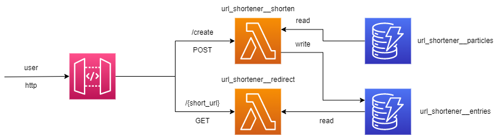

# 🔗 url_shortener

URL Shortener written in Go, deployed in AWS with API Gateway, Lambda and DynamoDB

## Architecture

The architecture of this project is as follows:



- An API built and deployed with API Gateway, that acts as an entrypoint for users.
- Two Lambda functions:
  - `url_shortener__shorten` - will accept a given URL, create a shortened version of it on DynamoDB
    and return the result.
  - `url_shortener__redirect` - takes a given shortened URL and redirects the user to the original
    "long" URL mapped to it on DynamoDB.
- Two DynamoDB tables:
  - `url_shortener__entries` - maps "short" URL endpoints (`short_url` field) to "long" URLs (`long_url` field).
    It should look something like this:
    | short_url | long_url |
    |-----------------------|--------------------------|
    | FoiDeEmacsWindows | https://www.google.com/ |
    | CafePateta2Kenan&Kell | https://www.youtube.com/ |
  - `url_shortener__particles` - table with a single field called `particle`. Each entry in this table
    represents a possible value to compose a "short" URL returned to the user. Whenever a new short URL
    is generated, three entries from this table will be randomly pulled (usign the hash of the original URL as seed)
    and concatenated to make up the result. It should look something like this:
    | particle |
    |----------|
    | FoiDe |
    | Emacs |
    | Windows |

## Getting Started

This project was developed and tested with Go 1.19. Support for other versions is not guaranteed.
The code was developed to run in three modes, which can be controlled by the
`API_HANDLER` environment variable:

- `"GIN"`: Uses the [Gin](https://gin-gonic.com/) library to host a local API. This is the default behavior.
- `"LAMBDA_SHORTEN"`: Handles requests to create a short URL, when deployed to a Lambda function.
- `"LAMBDA_REDIRECT"`: Handles requests redirect the user to the given short URL, when deployed to a Lambda function.

To build the executable for this project, run:

```bash
go mod download && go mod verify
go build -o url_shortener
```

You will need to manually enter values on the `url_shortener__particles` table
for the code to work, but that's part of the fun!

### Running locally

You will need AWS credentials to read and write on the two DynamoDB tables
(which you will probably have to create manually) used by the code, either
through access keys or an IAM Role. If you wish to use the default configuration
of your environment, no further setup is needed. If that's not the case, you will
need to export the environment variables `AWS_ACCESS_KEY_ID`, `AWS_SECRET_ACCESS_KEY`
and `AWS_DEFAULT_REGION`.

Aside from that, you need to export the following environment variables:

- `ENTRIES_TABLE_NAME` - name of the `url_shortener__entries` table, described above.
- `PARTICLES_TABLE_NAME` - name of the `url_shortener__particles` table, described above.
- `BASE_ENDPOINT` - base of the endpoint used by the short URLs. (Optional - by default `http://localhost:8080`)
- `DEFAULT_REDIRECT_ENDPOINT` - endpoint where the user will be redirected if they enter an invalid
  short URL. (Optional - by default it takes you to a fun place 🙂)

After that, you can either build and run the executable, or simply run `go run .`.

Finally, you can run:

```bash
$ curl -X POST -d '{"url": "https://www.youtube.com/watch?v=sWk9qsxEWKg"}' localhost:8080/create
{
    "short_url": "http://localhost:8080/JojoVimCafe",
    "long_url": "https://www.youtube.com/watch?v=sWk9qsxEWKg"
}
```

### Deploying to AWS

To deploy the project on AWS, you can use the [terraform](https://www.terraform.io/)
configuration available on the `terraform` directory. You will need to configure
the `profile` and `account_id` variables, as well as having credentials and
permitions to deploy the resources described there.

After deploying the infrastructure, you can go to the API Gateway console and
create a new Stage Deployment for the `url_shortener` API. After doing so,
a HTTPS endpoint will be automatically generated for you to invoke the API.

## Fun facts

### Why a url shortener?

One day I woke up and realized I knew how to make one, so why not?

### Why Go?

I started learning Go a while ago out of curiosity and decided to put a bit of
it into practice. I'm still not too familiar with it, so weird structures/idiomatic
implementations may exist because of that. I hope to keep improving though.

### Why have an entire separate table to create new shortened URLs instead of just generating them randomly?

It's more fun like that 😉.
